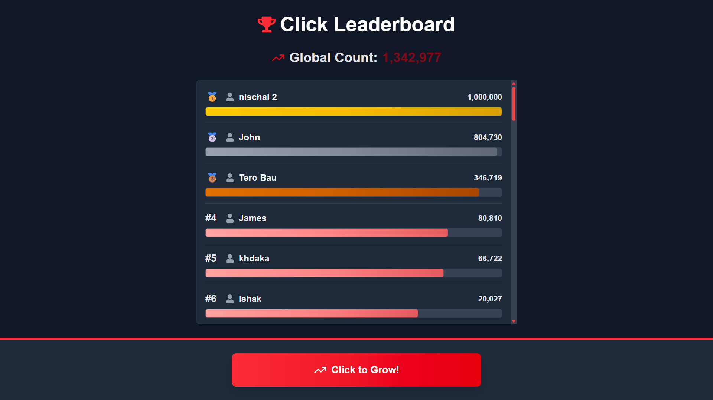

# Clickky

A high-performance real-time application built with Next.js frontend and in-memory Node.js/Express backend. Features real-time user interactions using Socket.io with MySQL data persistence every 30 seconds, capable of handling multiple concurrent users.

## 🚀 Live Demo

- **🌐 Live Website**: [https://clickky.vercel.app](https://clickky.vercel.app)
- **📂 Repository**: [https://github.com/david-rai/clickky.git](https://github.com/david-rai/clickky.git)

## Design


## 📋 Overview

Clickky is a real-time application that provides:
- **Lightning-fast performance** with in-memory data processing
- **Real-time user interactions** using Socket.io
- **Scalable architecture** handling multiple concurrent users
- **Efficient data persistence** with 30-second MySQL batch writes
- **Modern Next.js frontend** with server-side rendering
- **Robust Express.js backend** with memory-optimized operations

## ✨ Features

### ⚡ Real-time Capabilities
- Instant user interactions with Socket.io
- Live user presence and activity tracking
- Real-time data synchronization across all connected clients
- Zero-latency user experience with in-memory processing

### 🚀 Performance Optimization
- In-memory data storage for ultra-fast operations
- Batch database writes every 30 seconds
- Optimized for high concurrent user load
- Memory-efficient data structures

### 🔄 Data Management
- MySQL database for persistent storage
- Automatic data backup every 30 seconds
- Crash recovery with data persistence
- Efficient memory-to-database synchronization

## 🛠️ Tech Stack

- **Frontend & Backend**: Next.js 14+ (Full-Stack React Framework)
- **Server**: Node.js + Express.js (In-Memory Processing)
- **Database**: MySQL (Persistent Storage)
- **Real-time**: Socket.io (WebSocket Communication)
- **Deployment**: Vercel (Serverless Functions)
- **Version Control**: Git + GitHub

# 📁 PROJECT STRUCTURE

```
clickky/
├── 📂 .next/                       # Next.js build output
├── 📂 app/                         # Next.js App Router
│   ├── 🏠 page.js                 # Homepage
│   ├── 📊 dashboard/              # Dashboard pages
│   └── ⚙️  globals.css             # Global styles
├── 📂 public/                      # Static assets
│   ├── 🖼️  images/
│   └── 📄 favicon.ico
├── 📂 server/                      # Backend Server
│   ├── 📂 db/                     # Database utilities
│   ├── 📂 model/                  # Data models
│   ├── 📂 socket/                 # Socket.io handlers
│   ├── 📂 utils/                  # Helper functions
│   └── 🚀 server.js               # Main server file
├── 📂 node_modules/               # Dependencies
├── ⚙️  .gitignore                 # Git ignore rules
├── 📋 eslint.config.mjs           # ESLint configuration
├── 🔧 next.config.ts              # Next.js configuration
├── 📦 package.json                # Dependencies & scripts
├── 🔒 package-lock.json           # Dependency lock
├── 🎨 postcss.config.mjs          # PostCSS configuration
├── 📖 README.md                   # Project documentation
├── 🗃️  sql.txt                    # Database schema
└── ⚙️  tsconfig.json              # TypeScript configuration
```

## 🎯 COMPONENT BREAKDOWN

### 🌐 **Next.js App** (`/app/`)
| File/Folder | Purpose | Features |
|-------------|---------|----------|
| `page.js` | Homepage | Landing page, click interface |
| `dashboard/` | Admin panel | Real-time stats, user management |
| `globals.css` | Styling | Global styles and themes |

### 🔧 **Server Backend** (`/server/`)
| Folder | Purpose | Functionality |
|--------|---------|---------------|
| `db/` | Database layer | MySQL connection, queries |
| `model/` | Data models | User, Click, Stats models |
| `socket/` | Real-time | Socket.io event handlers |
| `utils/` | Utilities | Helper functions, validators |
| `server.js` | Main server | Express app, Socket.io setup |

## 🚀 Getting Started

### Prerequisites

- Node.js (v18 or higher)
- MySQL (v8.0 or higher)
- npm or yarn
- Git

### Installation

1. **Clone the repository**
   ```bash
   git clone https://github.com/david-rai/clickky.git
   cd clickky
   ```

2. **Install dependencies**
   ```bash
   npm install
   ```


### 30-Second Data Sync

```javascript
// Automatic sync service
setInterval(async () => {
  try {
    // Sync memory data to MySQL
    await syncMemoryToDatabase()
    
    // Clear processed data from memory
    await clearSyncedData()
    
    console.log(`✅ Data synced at ${new Date()}`)
  } catch (error) {
    console.error('❌ Sync failed:', error)
  }
}, 30000) // 30 seconds
```
## 🔄 Data Flow

```bash
1. User clicks button (Frontend)
   ↓
2. Socket.io emits click event
   ↓
3. Backend receives event → stores in memory
   ↓
4. Real-time broadcast to all connected users
   ↓
5. Every 30s: Memory data → MySQL database
   ↓
6. Memory cleanup after successful sync
```

## 🚀 Deployment

### Production Build

1. **Build Frontend:**
   ```bash
   cd frontend
   npm run build
   ```

2. **Prepare Backend:**
   ```bash
   cd backend
   npm run build # if you have build process
   ```
## 🛡️ Security

- **Input validation** on all endpoints
- **Rate limiting** for click events
- **SQL injection** prevention
- **CORS configuration** for frontend access
- **Environment variable** protection

## 🔧 Development

### Available Scripts

**Frontend:**
- `npm run dev` - Start development server
- `npm run build` - Build for production
- `npm run start` - Start production server

**Backend:**
- `npm run dev` - Start with nodemon
- `npm run start` - Start production server
- `npm run test` - Run tests


## 📈 Monitoring

### Real-time Metrics
- Active user count
- Clicks per second
- Memory usage
- Database sync status

**Last Updated**: September 2025
**Version**: 1.0.0
**Tech Stack**: Next.js + Node.js + Express + MySQL + Socket.io